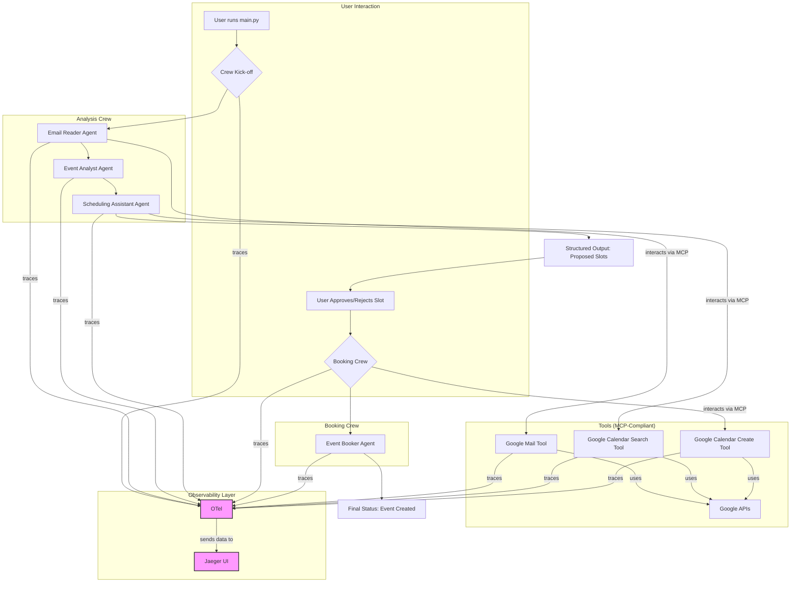

# Architecture: AI-Powered Scheduling Assistant with CrewAI

This document outlines the architecture for a demonstration project showcasing `crewai` integrated with observability tools to create a practical AI-powered scheduling assistant.

## 1. Overview

The project aims to build a multi-agent system using `crewai` that can:
1.  Read a user's emails via the Gmail API.
2.  Identify and parse potential real-world events or meetings mentioned in the emails.
3.  Check the user's Google Calendar for availability.
4.  Propose suitable time slots for the identified events.
5.  Wait for user approval.
6.  Create the event in Google Calendar upon approval.

A primary goal is to wrap this entire workflow in a robust **observability** layer using **OpenTelemetry**, allowing us to trace the execution flow from the initial email read to the final calendar event creation. This provides deep insights into agent performance, tool usage, and LLM interactions.

### High-Level Diagram



## 2. Core Concepts

### CrewAI
We leverage `crewai` for its structured approach to building agentic workflows. It allows us to define specialized agents with distinct roles, tools, and tasks, which are then orchestrated by a `Crew`. This project will use two crews:
1.  **Analysis Crew**: Scans emails and finds potential calendar slots.
2.  **Booking Crew**: Takes an approved slot and creates the calendar event.

### Model Context Protocol (MCP)
A core concept in this architecture is the **Model Context Protocol (MCP)**, an open standard that governs how AI systems connect to external tools and data. Instead of agents calling Python functions directly in a non-standard way, they will interact with tools through this structured protocol.

For this project, this means that when an agent needs to read an email or query a calendar, it's not just calling a simple function. It's interacting with a tool that is exposed via an MCP-compliant interface. This has several advantages:
- **Standardization**: The way the agent requests an action (e.g., "read emails") and receives data is standardized.
- **Security**: The protocol can enforce secure handling of credentials and context.
- **Interoperability**: Any AI model that "speaks" MCP could, in theory, use the tools we define.

### Observability with OpenTelemetry
This is the cornerstone of the project's traceability goal. By configuring `crewai` with an OpenTelemetry exporter, we can capture detailed traces of the entire workflow. Each agent's execution, task completion, and tool usage will be recorded as a "span," allowing us to visualize:
-   The total time taken for the crew to run.
-   The performance of individual agents and tools.
-   The inputs and outputs of each step.
-   The full context passed between agents.

We will use **Jaeger** as the backend to receive and visualize these traces locally.

## 3. Project Structure

The project will be organized as follows:

```
/crewai-observability
|
├── .env                  # Environment variables (API keys, OTel config)
├── main.py               # Main script to configure and run the crews
├── requirements.txt      # Python dependencies
|
├── /src
|   ├── __init__.py
|   ├── agents.py         # Definitions for all our CrewAI agents
|   ├── tasks.py          # Definitions for all our CrewAI tasks
|   └── tools/
|       ├── __init__.py
|       ├── google_calendar_tools.py # Tools for calendar search/creation
|       └── google_mail_tools.py     # Tool for reading emails
|
└── /docs
    ├── ARCHITECTURE.md   # This file
    ├── COMPONENTS.md     # Detailed breakdown of agents, tasks, and tools
    ├── OBSERVABILITY.md  # Guide to setting up and using the observability stack
    └── WORKFLOW.md       # Explanation of the end-to-end user flow
```

## 2. Core Concepts

### CrewAI
We leverage `crewai` for its structured approach to building agentic workflows. It allows us to define specialized agents with distinct roles, tools, and tasks, which are then orchestrated by a `Crew`. This project will use two crews:
1.  **Analysis Crew**: Scans emails and finds potential calendar slots.
2.  **Booking Crew**: Takes an approved slot and creates the calendar event.

### Model Context Protocol (MCP)
A core concept in this architecture is the **Model Context Protocol (MCP)**, an open standard that governs how AI systems connect to external tools and data. Instead of agents calling Python functions directly in a non-standard way, they will interact with tools through this structured protocol.

For this project, this means that when an agent needs to read an email or query a calendar, it's not just calling a simple function. It's interacting with a tool that is exposed via an MCP-compliant interface. This has several advantages:
- **Standardization**: The way the agent requests an action (e.g., "read emails") and receives data is standardized.
- **Security**: The protocol can enforce secure handling of credentials and context.
- **Interoperability**: Any AI model that "speaks" MCP could, in theory, use the tools we define.

### Observability with OpenTelemetry
This is the cornerstone of the project's traceability goal. By configuring `crewai` with an OpenTelemetry exporter, we can capture detailed traces of the entire workflow. Each agent's execution, task completion, and tool usage will be recorded as a "span," allowing us to visualize:
-   The total time taken for the crew to run.
-   The performance of individual agents and tools.
-   The inputs and outputs of each step.
-   The full context passed between agents.

We will use **Jaeger** as the backend to receive and visualize these traces locally.

## 3. Project Structure

The project will be organized as follows:

```
/crewai-observability
|
├── .env                  # Environment variables (API keys, OTel config)
├── main.py               # Main script to configure and run the crews
├── requirements.txt      # Python dependencies
|
├── /src
|   ├── __init__.py
|   ├── agents.py         # Definitions for all our CrewAI agents
|   ├── tasks.py          # Definitions for all our CrewAI tasks
|   ├── tools/
|   |   ├── __init__.py
|   |   ├── google_calendar_tools.py # Tools for calendar search/creation
|   |   └── google_mail_tools.py     # Tool for reading emails
|   |
|   └── mcp/
|       ├── __init__.py
|       └── connection_manager.py # Simulated MCP for Google API connections
|
└── /docs
    ├── ARCHITECTURE.md   # This file
    ├── COMPONENTS.md     # Detailed breakdown of agents, tasks, and tools
    ├── OBSERVABILITY.md  # Guide to setting up and using the observability stack
    └── WORKFLOW.md       # Explanation of the end-to-end user flow
```

## 4. Next Steps

The following documents provide more detail on each part of the architecture:
-   **[COMPONENTS.md](./docs/COMPONENTS.md)**: A deep dive into the agents, tasks, and tools.
-   **[OBSERVABILITY.md](./docs/OBSERVABILITY.md)**: How to set up and interpret the observability stack.
-   **[WORKFLOW.md](./docs/WORKFLOW.md)**: A step-by-step description of the process flow, including the human-in-the-loop approval.
